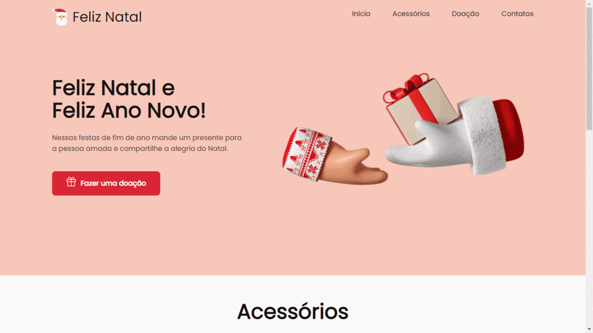

# Landing Page - Balle Bot

> Esse projeto, trata-se de uma landing page para desenvolvida para mostrar o espirito natalino e de ano novo. O designer da página foifeita por uma membro de uma comunidade do telegram, eu apenas transformei o seu protótipo em realidade.

## :camera_flash: Versão Desktop da Landing Page

## :hammer_and_wrench: Tecnologias utilizadas
 Foram utilizadas as segintes ferramentas no desenvolvimento:
 - HTML
 - CSS
 - Protótipo :link: [Figma](https://www.figma.com/file/Yb9IBH56g7T1hdIyZ3BMNO/Desafios---Codel%C3%A2ndia?node-id=39341%3A687)

## :nerd_face: Aprendizados
O que eu aprendi e coloquei em prática, com o desenvolvimento dessa landing page:
 - Divisão do html (header, nav, main e footer);
 - Utilização de fontes externas :link: ([Poppins](https://fonts.google.com/specimen/Poppins));
 - Aprendi a fazer um scroll suave com apenas utilizando um recurso própio do html (``scroll-behavior: smooth;``);
 - Flex-box.

## :page_facing_up: Requisitos
- Qualquer sistema operacional;
- Editor de texto :link: [VS Code](https://code.visualstudio.com/)
- Extensão para o VS Code :link: [Live Server](https://marketplace.visualstudio.com/items?itemName=ritwickdey.LiveServer)
- Browser :link: [Chrome](https://www.google.pt/intl/pt-PT/chrome/?brand=ISCS&gclid=CjwKCAiAtouOBhA6EiwA2nLKHzAVeY7vzxHKqYQHR9e2iF4Q-UYwVeNg_5CdIuPOs6RF2hbwjslc8xoCK3QQAvD_BwE&gclsrc=aw.ds)

## :pencil: Licença
Livre para uso e alteração
